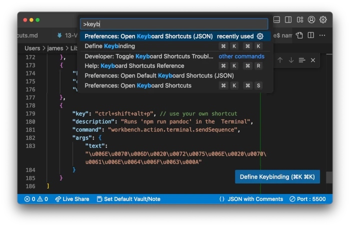

# Create a keybinding generator with NodeJS #

How often do you:

* Activate the integrated Terminal in VS Code
* Type `node index.js`
* Press the Enter key?

How long does it take each time?

How long does it take to press a keyboard shortcut, while your fingers are still close to the keyboard because you've just finished editing `index.js`?

How much longer would your coffee break be if you could create a keyboard shortcut to run `node index.js` with a keyboard shortcut?

How much time should you invest in setting up your computer so that you can save seconds here and there?


## The solution

VS Code allows you to create [key bindings for the Terminal](https://code.visualstudio.com/docs/terminal/advanced#_custom-sequence-keybindings)

To see the keybindings that are already active, you can:

* Open the [Command Palette](https://code.visualstudio.com/docs/getstarted/tips-and-tricks#_command-palette), using one of the following methods:
  - Menu item View > Command Palette
  - `Ctrl-Shift-P` (for "Palette")
  - `F1` (or perhaps `fn + F1` depending on your [function lock](https://www.google.com/search?q=function+lock+toggle))

* Start typing the word `keyboard` (but you won't need to type more than four letters), until you see an entry for `Preferences: Open Keyboard Shortcuts (JSON)`



Your file might be empty, or it might already contain some JSON blocks like this:

```json
{
    {
        "key": "ctrl+shift+alt+,",
        "command": "editor.emmet.action.wrapWithAbbreviation"
    },
    {
        "key": "ctrl+shift+k",
        "command": "markdown.showPreview",
        "when": "!notebookEditorFocused && editorLangId == 'markdown'"
    },
}
```
Listing 1.

## A suggestion

You could add an entry like this to `keybindings.json`, and save the file:

```json
{
    "key": "ctrl+shift+alt+X", // use your own shortcut
    "description": "Runs 'node index.js' in the  Terminal",
    "command": "workbench.action.terminal.sendSequence",
    "args": {
        "text": "\u006E\u006F\u0064\u0065\u0020\u0069\u006E\u0064\u0065\u0078\u002E\u006A\u0073\u000A"
    }
},
```
Listing 2.

From now on, you will be able to type `ctrl+shift+alt+X` (or whatever keyboard shortcut you choose to use instead) to execute `node index.js`, regardless of which part of VS Code is active.

## A challenge

1. Use [Dencode.com](https://dencode.com/string/unicode-escape) to discover what the text `"\u006E\u006F\u0064\u0065\u0020\u0069\u006E\u0064\u0065\u0078\u002E\u006A\u0073\u000A"` means.

> Note: You have to speak to the Terminal in its native dialect.
> 
> Your computer doesn't understand words or even characters. It understands strings of `1`s and `0`s. The Unicode Escape format used above makes it possible to give a different number to all the different characters used in all known human languages. VS Code's `.terminal.sendSequence` command expects that all the text it is given is in the form of a hexadecimal number. This makes it possible to use any language (like Arabic, Chinese or Hindu) when working in the Terminal. To the Terminal, it's all just numbers.

2. Use the file `index.js` to write a script that will generate a JSON block like the one in Listing 2 above.
3. Make a generic second version of your script, so that you can generate a JSON block for any command that you need to run often in the Terminal.

## Specifications

For version 1, you simply run `node index.js` in the Terminal, and it should output the text from Listing 2.

For version 2, you run a command like `node index.js echo Hello World!` and your script will output a customized JSON block that you can add to `keybindings.json`. After you save `keybindings.json` and press the associated shortcut, the command specified as the argument for `node index.js` will run in the Terminal.

## Hints

0. Make a note of the time before you start.

1. When you run a script with node, the global object `process.argv` contains an array that might look something like this:

```javascript
[
  '/path/to/executable/for/node',
  '/path/to/your/index.js',
  'echo',
  'Hello',
  'World'
] 
```

2. You can use `process.argv.slice(2)` to obtain an array of just the arguments that were added.

3. You can convert an array of words to a single expression, where each word is separated by a space, using `array.join(" ")`.

4. You will need to convert each character, one by one from ASCII (which defines 128 different characters) to Unicode Escape (which can define up to 65536 characters).

5. You can split a string into an array of indivdual characters with `"string".split("")` or `[..."my string"]`. (This last technique uses the [spread operator](https://developer.mozilla.org/en-US/docs/Web/JavaScript/Reference/Operators/Spread_syntax)).

6. To get the number associated with a letter, you can use `charCodeAt()`. For example, `"a".charCodeAt(0)` returns the value `97`.

7. Unicode Escape works with numbers in hexadecimal (`0` - `F`). To convert an ASCII character to a hexadecimal number, you can use `Number().toString(16)`. For example: `"z".charCodeAt(0).toString(16).toUpperCase()` will  give `7A`.

8. To convert an array of ASCII characters to Unicode Escape, you can use either:
   * Array.map(char => { ... }).join("") ([MDN](https://developer.mozilla.org/en-US/docs/Web/JavaScript/Reference/Global_Objects/Array/map))
   OR
   * Array.reduce((output, char) => { ... }, "")  ([MDN](https://developer.mozilla.org/en-US/docs/Web/JavaScript/Reference/Global_Objects/Array/reduce))

9. To convert a hexadecimal number like `7A` to Unicode Escape format, you will need to prepend `\u00`. For example, `z` becomes `7A` which becomes `\u007A`.

10. The character `\` has a [special meaning as an "escape" character](https://developer.mozilla.org/en-US/docs/Web/JavaScript/Reference/Regular_expressions/Character_escape) in JavaScript strings. To include a `\` in a string, you need to _escape_ it with another `\` character. 

Try this in your Terminal:
```bash-#w
node
Welcome to Node.js v23.1.0.
Type ".help" for more information.
> zHex = `7A`
'7A'
> prefix = '\u00'
prefix = '\u00'

Uncaught SyntaxError: Invalid Unicode escape sequence
> prefix = '\\u00'
'\\u00'
> zUnicodeEscape = prefix + zHex
'\\u007A'
> console.log(zUnicodeEscape)
\u007A
undefined
```
> Note `undefined` is the _result_ of the call to `console.log()`, because it does not return any value. The string `\u007A` is a _side effect_ of the call to `console.log()`.

11. To create a multiline string in JavaScript, you can use `backticks` (`` ` ``) and [string templates](https://developer.mozilla.org/en-US/docs/Web/JavaScript/Reference/Template_literals).

12. You will need to add the code for LINE FEED at the end of the command, to tell the Terminal to simulate pressing the Enter key.

    `+ "\\u000A\""`
    
    See [here for more details](https://en.wikipedia.org/wiki/Unicode_control_characters#Category_"Cc"_control_codes_(C0_and_C1)).

13. To decide if this exercise was worth the time, note what time it was when you decide that you had done all the work on your script that it needed. Subtract from that the time you noted down in step `0`, and consult [Randall Munroe's table](https://explainxkcd.com/1205) to see how often you must use a shortcut to regain the time you have invested.

Remember, though, that you also improved your JavaScript skills during this time. So that's an added benefit.